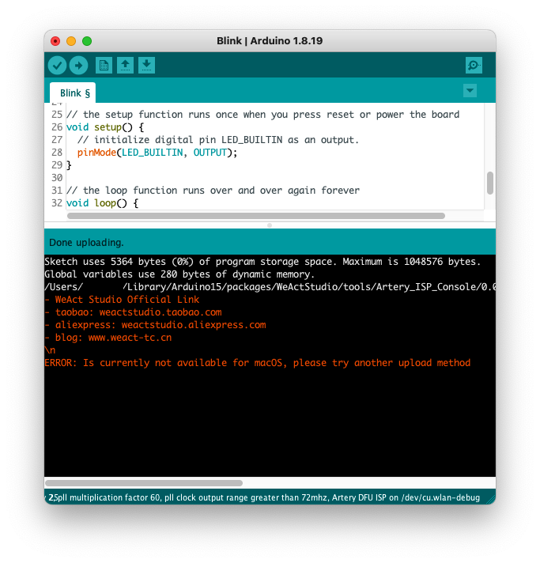

# ArduinoCore-AT32F4
## Introduction

This repository is a fork of the original work by [WeActStudio](https://github.com/WeActStudio/ArduinoCore-AT32F4).

The purpose of this fork is to extend support for compiling and uploading Arduino code to WeAct AT32F4-based boards. It's important to note that this fork does not aim to introduce improvements or fixes to the original work by WeActStudio.

### Changes for macOS M1

This fork includes the following changes specifically for macOS M1:

- Addition of the ARM64 version of the GCC compiler (`xpack-arm-none-eabi-gcc-11.2.1-1.2-darwin-arm64`).
- Inclusion of the Artery OpenOCD port, which provides versions for Windows, Linux, and macOS.
- Addition of a shell script for the Artery ISP Console upload method. This script prints a message indicating that this upload method is currently not available for macOS.

### Supported Upload Methods

Currently, the following upload method is supported:

- OpenOCD via a DAPLink adapter.
- OpenOCD via a ST-Link adapter

For testing purposes, the [WeActStudio Mini Debugger](https://github.com/WeActStudio/WeActStudio.MiniDebugger) (ST-Link STM32F103CBT6 and DAPLink APM32F103CBT6) was used.

### Adding the Core to Arduino

To add the core to Arduino, follow these steps:

1. Add the following URL to the Arduino Boards Manager:
 
`https://raw.githubusercontent.com/KenjutsuGH/ArduinoCore-AT32F4/main/package_at32_index.json`

2. Proceed to **Tools** -> **Boards Manager** in the Arduino IDE and search for **AT32**.

3. After the installation is complete, you'll be able to select the WeActStudio board.

## Uploading to the WeActStudio board

For the purpose of this demonstration, navigate to **Files** -> **Examples** -> **01.Basics** -> **Blink**. Under the **Tools** menu, the following upload methods are available:

- The default option, **Artery DFU ISP**, is currently not supported on macOS and will produce the following error when attempting to upload to the board:

- The next option is **Artery OpenOCD DAPLink**. Ensure that the DAPLink adapter is correctly connected to the AT32F4 board before proceeding with the upload. Now the upload should proceed as expected:

 
- The next option is **Artery OpenOCD ST-Link**. Ensure that the ST-Link adapter is correctly connected to the AT32F4 board before proceeding with the upload. Now the upload should proceed as expected:

 

## Disclaimer

The code and information provided in this repository are for educational and informational purposes only. While efforts have been made to ensure the accuracy and reliability of the content, no warranty, express or implied, is provided regarding the completeness, accuracy, reliability, suitability, or availability of the code or information contained herein.

Usage of the code and information from this repository is at your own risk. The author(s) and contributors of this repository shall not be liable for any loss, damage, or injury arising from the use of or reliance on the code or information provided, including but not limited to direct, indirect, incidental, consequential, or punitive damages.

Furthermore, the code and information provided in this repository may be subject to change without notice. The author(s) and contributors reserve the right to modify, update, or remove any content from this repository at their discretion.

By accessing and using the code and information from this repository, you agree to indemnify and hold harmless the author(s) and contributors from any claims, damages, losses, liabilities, costs, and expenses arising from or related to your use of or reliance on the code or information provided herein.
